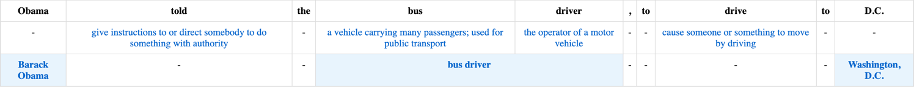

# Word Sense Disambiguation

We use spaCy for classical analysis (tokenization, POS tagging, etc.) + 
[entity linking](https://pypi.org/project/spacy-entity-linker/), 
and have our own implementation for [word sense disambiguation](./wsd/word_sense_disambiguation.py).

We expose a [web server](./wsd/server.py) that can be used to disambiguate words in sentences.

## Environment Variables

The application requires the following environment variable:

- `WORDNET_URL`: URL of the WordNet API server (default: `http://127.0.0.1:8000`)

### Running locally

```shell
export WORDNET_URL=http://127.0.0.1:8000
uvicorn --reload wsd.server:app --port 8005 
```

Or set it inline:
```shell
WORDNET_URL=http://127.0.0.1:8000 uvicorn --reload wsd.server:app --port 8005 
```

### Running with Docker

```shell
docker build -t wsd .
docker run -p 8000:8000 -e WORDNET_URL=http://127.0.0.1:8000 wsd
```

## Usage

To view an output, visit this [example link](http://localhost:8000/disambiguate?text=Obama%20told%20the%20bus%20driver,%20to%20drive%20to%20D.C.&lang=en&output=html) (adjust port if running locally):

