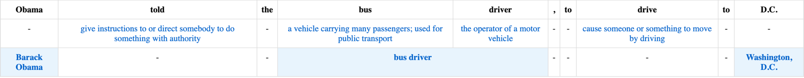

# Word Sense Disambiguation

We use spaCy for classical analysis (tokenization, POS tagging, etc.) + 
[entity linking](https://pypi.org/project/spacy-entity-linker/), 
and have our own implementation for [word sense disambiguation](./wsd/word_sense_disambiguation.py).

We expose a [web server](./wsd/server.py) that can be used to disambiguate words in sentences.

## Environment Variables

- `WORDNET_URL`: URL of the WordNet API server (see below). Required; the server image sets it. When it is
  unset and the API package is installed (the cluster images built by `training/Enrootfile.sh` and
  `wsd/Enrootfile.sh`), the process starts a private API instance and uses that, so batch, training and
  benchmark jobs need no separate service.
- `WSD_MODEL`: model name or local checkpoint directory (default `sign/ModernBERT-Large-Instruct-WSD`).

### WordNet API server

Definitions come from the WordNet API in https://github.com/sign/wn (the `wn` library plus a REST layer, with
Wikidata lexemes merged into the English lexicon). Run it with Docker:

```shell
docker run -d --name wn -p 8000:8080 ghcr.io/sign/wn:latest
export WORDNET_URL=http://127.0.0.1:8000
curl "$WORDNET_URL/health"
```

The server listens on `$PORT` (default 8080). It is stateless, so one instance can serve many clients; the
batch endpoint used here (`POST /lexicons/omw-en:1.4/definitions`) answers ~1,000 queries per request.
Without Docker (e.g. a Slurm node with enroot): `enroot import -o wn.sqsh docker://ghcr.io#sign/wn:latest`
and run `uvicorn wn.web:app --host 0.0.0.0 --port 8080` inside it, or rely on the built-in local start above.

### Running locally

```shell
export WORDNET_URL=http://127.0.0.1:8000
uvicorn --reload wsd.server:app --port 8080
```

### Running with Docker

```shell
docker build --platform="linux/amd64" -t wsd .
docker run -p 8005:8080 -e PORT=8080 -e WORDNET_URL=http://host.docker.internal:8000 wsd
```

## Batch processing

To disambiguate a corpus offline (one sentence per line, one JSON line out per sentence), split it into
many files and run `wsd.batch`; under `torchrun` each rank takes every N-th file and finished files are
skipped on restart:

```shell
split -n l/256 corpus.txt shards/part-
python -m wsd.batch --input 'shards/part-*' --output-dir out/ [--no-entities] [--skip-single-sense]
```

See [wsd/README.md](./wsd/README.md#throughput) for measured throughput.

Multiword expressions that WordNet lists (`test tube`, `New York`, `give up`) are disambiguated as one unit
first; each of their tokens carries the shared synset and the `expression` it belongs to. Only when the
model answers "none of the above" for the expression are its words disambiguated individually.

## Usage

To view an output, visit this [example link](http://localhost:8005/disambiguate?text=Obama%20told%20the%20bus%20driver,%20to%20drive%20to%20D.C.&lang=en&output=html) (adjust port if running locally):


